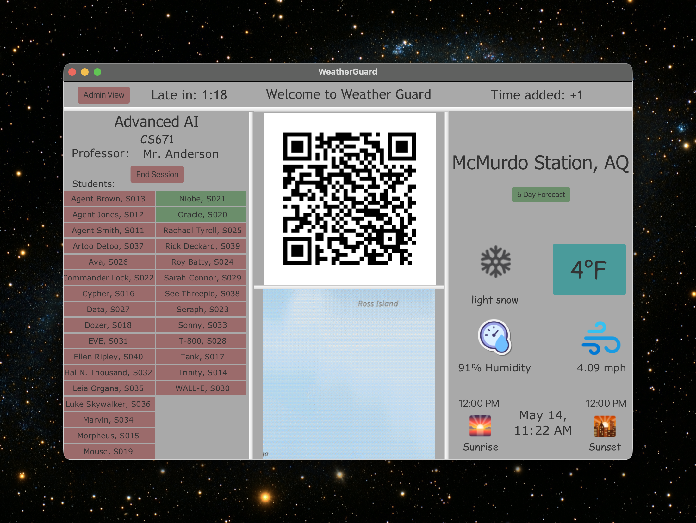
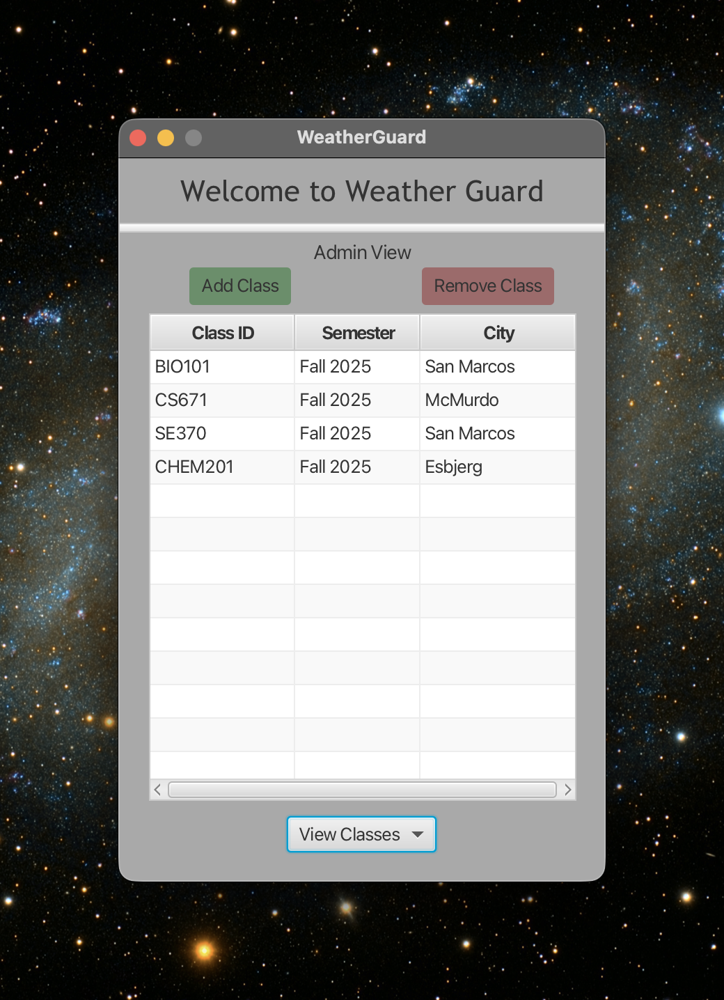
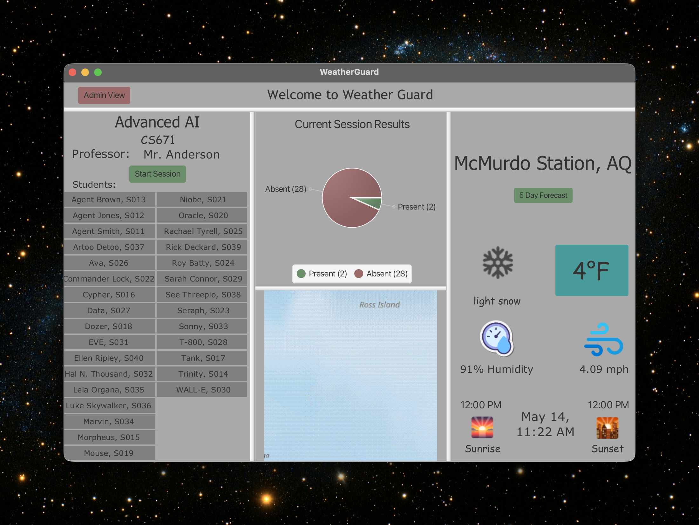
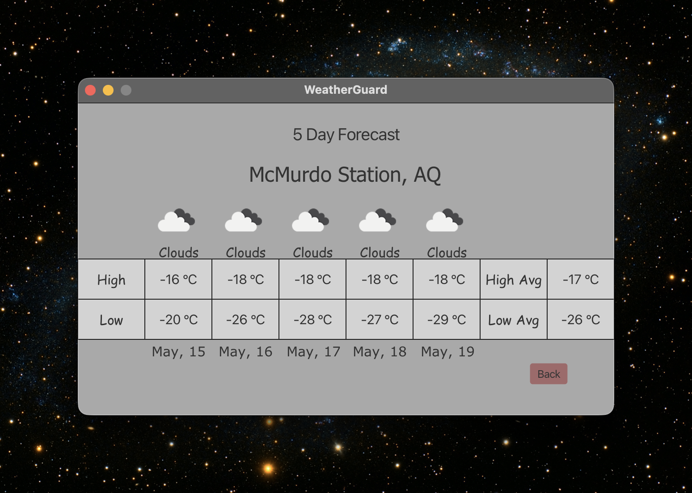

# WeatherGuard Attendance

> A JavaFX desktop app where students check in by scanning a session QR code while the instructor's view shows live attendance, real-time weather, and an end-of-session breakdown. Built in SE 370, refactored in SE 471 around three behavioral design patterns.

**Team 04 · Spring 2026** — Judah Fisher · Josh Clemens · Chima Ohaechesi · Roger Karam

---

## What it does

- **QR-code check-in** — students scan a session-specific code on their phone; check-ins post through Netlify into MongoDB.
- **Live dashboard** — instructor sees each student's status update in real time, no manual refresh.
- **Weather-aware** — current conditions and a 5-day forecast from OpenWeatherMap; attendance rules can adapt to extreme weather.
- **Session summary** — three-slice pie chart (present / late / absent) when the session ends.

## Design patterns at the core

The SE 471 refactor is the whole point of this version. Three behavioral patterns replaced three SE 370 code smells:

| Pattern | Replaces | Lives in |
|---|---|---|
| **Observer** | A 2-second JavaFX `Timeline` polling MongoDB | `…/weatherguard/Observer/` |
| **State** | `boolean sessionActive` + scattered `if` guards | `…/weatherguard/State/` |
| **Strategy** *(+ Decorator)* | Hardcoded `"present"` string and `boolean useFahrenheit` | `…/weatherguard/Strategy/` |

Original SE 370 patterns kept and integrated cleanly: **Singleton** on `DatabaseManager`, **Façade** on `WeatherService`, **Transfer Object** across the model layer.

### Observer
`TeacherViewController` is the Subject. Every check-in fires an immutable `AttendanceEvent` to any registered `AttendanceObserverIF` — no polling at the consumer side.

### State
Session lifecycle is a polymorphic hierarchy: `Inactive → Active → Closed`. Click handlers are one-line delegations (`state.startSession(this)`); transitions are atomic via `onEnter` / `onExit` hooks.

### Strategy (+ Decorator)
Two interfaces, swappable at runtime:
- `AttendanceRuleStrategyIF` — `Strict`, `GracePeriod`, and `WeatherLeniency` (a true Decorator that delegates to the inner rule first, then upgrades `late → present` in extreme cold).
- `TemperatureDisplayStrategyIF` — `Fahrenheit` and `Celsius`, held inside the `WeatherService` Façade.

---

## Screens

| View | What to look at |
|---|---|
|  | **Admin View** — class roster management, CSV import |
|  | **Teacher View** — QR code, live attendance grid, current weather |
|  | **5-Day Forecast** — extended weather context for upcoming sessions |

---

## Tech stack

JavaFX 21 · Gradle · MongoDB Atlas (Java driver) · OpenWeatherMap API · ZXing (QR) · Netlify (student check-in page).

---

**Course:** SE 471 Software Architecture · **Instructor:** Dr. Yang Yue · **CSUSM**
